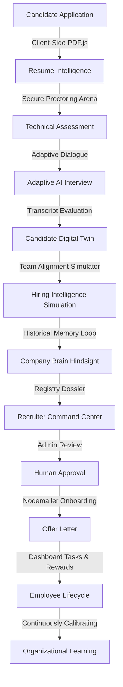

# 🌌 KarsaTek HireOS
### The Enterprise AI Hiring Intelligence Platform powered by Hindsight Memory & cascadeflow Runtime Intelligence
**Assess. Reason. Predict. Hire.**

[](LICENSE)
[](https://nextjs.org/)
[](https://www.mongodb.com/)
[](#proctoring-framework)

---

## ⚡ Executive Summary

KarsaTek OS (HireOS) is an enterprise-grade AI Hiring Intelligence Operating System that automates the complete recruitment lifecycle—from resume intelligence to onboarding.

Unlike traditional ATS platforms, HireOS combines:
*   🧠 Adaptive AI Interviews
*   🧬 Candidate Digital Twins
*   🕸️ Company Knowledge Graph
*   📊 Predictive Hiring Simulation
*   🧠 Hindsight Organizational Memory
*   ⚡ cascadeflow Runtime Intelligence

Together, these components enable explainable, continuously learning hiring decisions while significantly reducing AI inference costs through intelligent model routing.

---

## 🚀 Key Features

*   **🧠 Hindsight Company Brain**: Continuously stores interview transcripts, hiring decisions, recruiter feedback, onboarding outcomes, and employee lifecycle events. Every hiring decision becomes organizational memory, allowing the AI to compare future candidates with historical hiring success patterns.
*   **⚡ cascadeflow Runtime Intelligence**: Routes every AI task to the most efficient language model based on complexity. Lightweight models handle resume parsing and summaries, while advanced reasoning models power adaptive interviews and hiring simulations. All routing decisions are logged to provide token usage analytics and cost savings.
*   **📄 Browser-Parsed Resume Ingestion**: Uses client-side PDF.js rendering to extract text layout vectors directly in the user's browser—offloading compute overhead and bypassing serverless size restrictions on Vercel.
*   **🛡️ Strict Fullscreen Proctoring**: Forces candidate assessments and interview sessions into native browser fullscreen mode. Tab shifts, window blurs, or exit attempts immediately freeze the UI under a security lock, incrementing security breach strikes.
*   **🧠 Cognitive Assessment Engine**: Dynamically generates custom technical screening questions based on the selected domain (Frontend Architect, Sovereign Backend, or AI/ML).
*   **🎙️ Adaptive AI Debate Interview**: Engages candidates in a multi-turn, speech-to-text debate simulation where the AI acts as a Senior Engineering Manager, testing edge-cases, system design tradeoffs, and culture fit.
*   **📊 Predictive Hiring Simulation**: Computes team compatibility indices, success probability scores, and burnout risk metrics using AI-driven simulation workflows.

---

## 🏗️ Neural Architecture



---

## 🧠 Hindsight Organizational Memory

HireOS integrates Hindsight as its persistent organizational memory layer.

Unlike traditional recruitment systems that stop learning after the offer letter, HireOS continuously records:
*   Resume Intelligence
*   Assessment Results
*   AI Interview Transcripts
*   Hiring Decisions
*   Manager Feedback
*   Promotion History
*   Performance Reviews
*   Exit Interviews
*   Attrition Reasons

This historical intelligence forms the Company's Hiring Brain. 

When evaluating a new candidate, the AI compares them against previous successful and unsuccessful hires, enabling explainable hiring recommendations backed by organizational memory rather than isolated resume analysis.

---

## ⚡ cascadeflow Runtime Intelligence

HireOS integrates cascadeflow as its intelligent AI orchestration layer.

Instead of executing every request on the same language model, cascadeflow dynamically selects the optimal model based on reasoning complexity:

*   **Resume Parsing** ──> Llama-3.1-8B
*   **Assessment Evaluation** ──> Llama-3.1-8B
*   **Interview Debate Mode** ──> Llama-3.3-70B
*   **Hiring Simulation** ──> Llama-3.3-70B
*   **Company Brain Reasoning** ──> Llama-3.3-70B

Every routing decision is logged inside the AI Audit Console, providing:
*   Token Consumption
*   Runtime Latency
*   Estimated Cost Savings
*   Model Selection History

This reduces infrastructure cost while maintaining enterprise-grade reasoning quality.

---

## 🧠 AI Intelligence Layers

HireOS is built around five intelligence layers:
1.  **Resume Intelligence**: Raw layout vectors extracted client-side and mapped to internal tech-stack profiles.
2.  **Adaptive Interview Intelligence**: Real-time response-hesitation monitoring and contextual question generation in AI Debate Mode.
3.  **Candidate Digital Twin**: High-dimensional telemetry representation of applicant skills and integrity metrics.
4.  **Company Brain (Hindsight)**: Relational feedback loops linking interview performance to employee career outcomes.
5.  **Runtime Intelligence (cascadeflow)**: Dynamic cost-saving execution and routing matrix.

---

## 🔄 AI Runtime Flow

```
Candidate Upload
      │
      ▼
 cascadeflow Router
      │
      ├─► Resume Parsing (Llama-3.1-8B)
      ├─► Assessment Grading (Llama-3.1-8B)
      ├─► Interview Debate (Llama-3.3-70B)
      └─► Hiring Simulation (Llama-3.3-70B)
      │
      ▼
 Hindsight Memory Storage
      │
      ▼
 Recruiter Decision Center
```

---

## 📂 Repository Structure

```
├── README.md               # Main startup documentation
├── LICENSE                 # MIT License details
├── CONTRIBUTING.md         # Open-source contributing guidelines
├── package.json            # Core project dependencies & scripts
├── docs/                   # Exhaustive system documentation
│   ├── architecture.md     # System design & database schemas
│   ├── workflow.md         # Anti-cheat & assessment lifecycles
│   └── api.md              # Endpoint payload specifications
├── src/
│   ├── app/                # Next.js 16 (Turbopack) app routing
│   │   ├── apply/          # Resume upload & screening interface
│   │   ├── test/           # Strict proctored assessment arena
│   │   ├── interview/      # Adaptive AI dialogue terminal
│   │   ├── admin/          # Admin registry dashboard
│   │   ├── api/            # Serverless backend endpoints
│   │   └── workspace/      # Authenticated employee dashboard
│   ├── components/         # Premium UI layout elements (Framer Motion)
│   └── lib/                # Database clients, AI flows, & templates
```

---

## 🛠️ Technology Stack
*   **AI Runtime**: Groq Llama Models
*   **Memory Layer**: Hindsight
*   **Runtime Intelligence**: cascadeflow
*   **Authentication**: Clerk
*   **Database**: MongoDB Atlas
*   **Framework**: Next.js 16.2.6 (App Router, Turbopack)
*   **Styling**: Vanilla CSS, TailwindCSS configuration, Framer Motion
*   **Mailing**: SMTP Transporter (Nodemailer)

---

## ⚙️ Quick Installation

### Prerequisites
*   Node.js v18.0.0 or higher
*   MongoDB Atlas Connection URI
*   Clerk API Keys
*   Groq API Key

### Setup
1.  **Clone the Repository**:
    ```bash
    git clone https://github.com/ravirajjavvadhi/kevrynoff.git
    cd kevrynoff
    ```

2.  **Install dependencies**:
    ```bash
    npm install
    ```

3.  **Environment Variables**:
    Create a `.env.local` file in the root directory:
    ```env
    DATABASE_URL="mongodb+srv://..."
    GROQ_API_KEY="gsk_..."
    CLERK_SECRET_KEY="sk_..."
    NEXT_PUBLIC_CLERK_PUBLISHABLE_KEY="pk_..."
    EMAIL_USER="admin@domain.com"
    EMAIL_PASS="SMTP_secret_key"
    ```

4.  **Run Development Server**:
    ```bash
    npm run dev
    ```
    Access the portal at `http://localhost:3000`.

---

## 🗺️ Future Roadmap
- [ ] **AI Video Proctoring**: Add client-side face mesh and eye-tracking heuristics via TensorFlow.js to verify active candidate presence.
- [ ] **Cryptographic Verification**: Deploy offer letter validation certificates to the Solana blockchain network.
- [ ] **Collaborative Debate Rooms**: Support multi-candidate AI debate proctoring sessions for leadership roles.

---

## 👥 Contributors
This platform is built and maintained by:
*   **Raviraj Javvadi** ([@ravirajjavvadi](https://github.com/ravirajjavvadi)) - Core Architect & Integration lead
*   **Bhoompally Kalyan Reddy** ([@kalyan-1845](https://github.com/kalyan-1845)) - AI Debate Mode & Telemetry Simulation pipelines
*   **Satvi27-debug** ([@Satvi27-debug](https://github.com/Satvi27-debug)) - Technical Article Writing & System Documentation

---

## 📄 License
Distributed under the MIT License. See [LICENSE](LICENSE) for more details.
